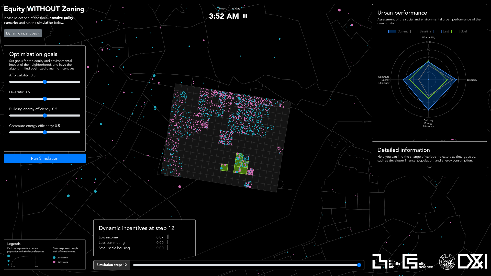

Frontend for the Equity WITHOUT Zoning workshop, made with Vue and D3.js

Interface design by Hexin Zhang [@JoseZhangSH](https://github.com/JoseZhangSH)

Code by Shengchen Zhang [@shaunabanana](https://github.com/shaunabanana)

## Project setup
```
npm install
```

### Compiles and hot-reloads for development
```
npm run serve
```

### Compiles and minifies for production
```
npm run build
```

### Lints and fixes files
```
npm run lint
```
